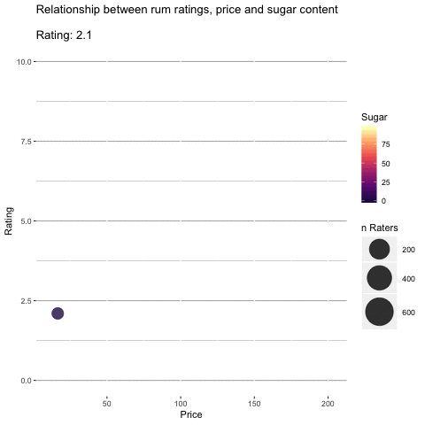

```{r setup, include=FALSE}
knitr::opts_chunk$set(echo = TRUE, warning = FALSE, message = FALSE, 
                      fig.width = 10, fig.height = 10)
```

## Load packages

```{r}
library(tidyverse)
library(gridExtra)
library(betareg)
library(plotly)
library(magrittr)
library(caret)
library(gganimate)
```

## Explore data


## Correlations and scatterplots


## Regression models


## Interactive plots
```{r eval = FALSE}
df %>%
  ggplot(aes(x = Price, y = Rating, size = Raters, colour = Sugar)) +
  geom_point(alpha = .8) +
  scale_colour_viridis_c(option = "A") +
  scale_size(range = c(5, 15)) +
  theme(panel.background = element_rect(fill = "white")) +
  ylim(0,10) +
  guides(size = guide_legend(title = "n Raters")) +
  labs(title = 'Rating: {round(frame_time)}') +
  transition_time(Rating) +
  ease_aes('linear')
```

```{r, out.width = "400px"}

```

```{r}
df %>%
  plot_ly(x = ~Price, y = ~Sugar, z = ~Rating, color = ~Category, size = ~Raters,
             marker = list(symbol = 'circle', sizemode = 'diameter',colorscale = 'Viridis'), sizes = c(10, 25),
             type='scatter3d', mode='markers', hoverinfo = 'text',
             text = ~paste('Label:', Label, '<br>Country:', Country, '<br>Category:', Category,
                           '<br>Rating:', Rating, '<br>Price:', Price,'<br>Sugar:', Sugar)) %>%
  layout(title = 'Relationship between rum ratings, price and sugar content')
```